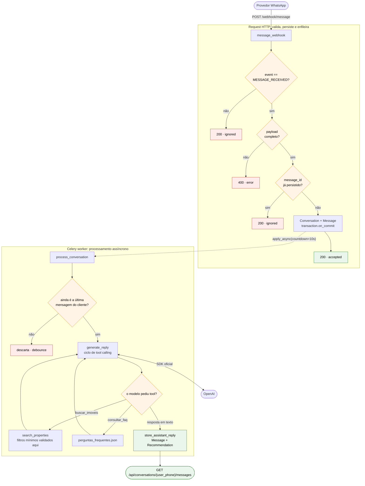
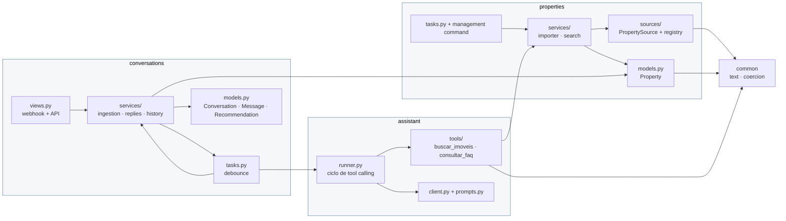
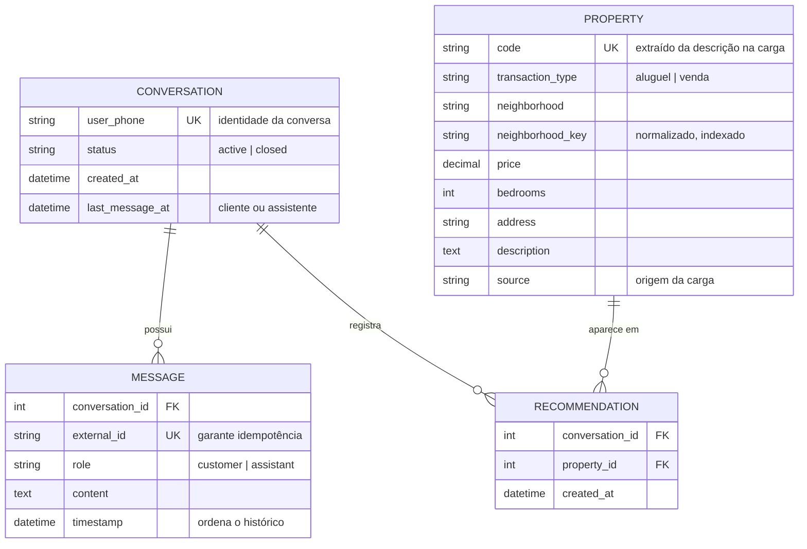
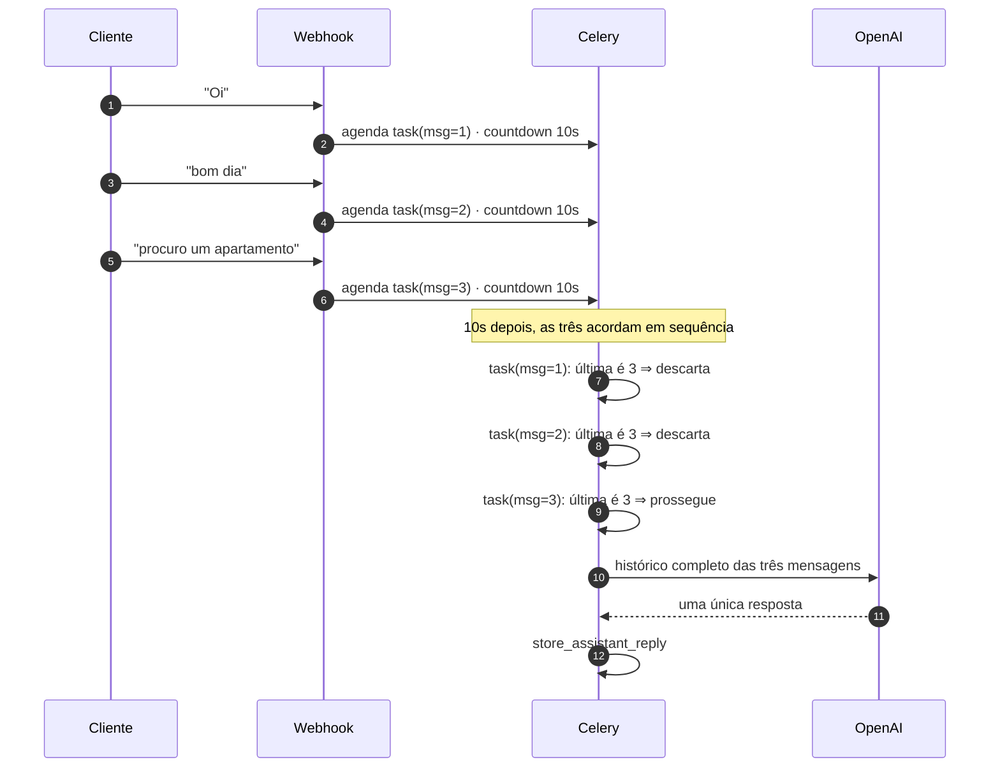

# Arquitetura

Documento principal de decisões. Os anexos detalham contextos específicos:

- [`docs/ARCHITECTURE_BUSINESS_RULES.md`](docs/ARCHITECTURE_BUSINESS_RULES.md): regras de negócio implementadas e onde cada uma vive.
- [`docs/ARCHITECTURE_DATA_LOADING.md`](docs/ARCHITECTURE_DATA_LOADING.md): carga de imóveis e como adicionar novos formatos.
- [`docs/ARCHITECTURE_SCALABILITY.md`](docs/ARCHITECTURE_SCALABILITY.md): limites conhecidos e caminhos de evolução.

---

## 1. Visão geral

O caminho de uma mensagem, da chegada no webhook até o histórico consultável. A linha tracejada é a
fronteira entre o que responde na request e o que roda no worker.

### Stack

A base veio definida pelo desafio, então o mérito não está em escolher, e sim em usar cada peça pelo
que ela realmente resolve aqui:

| Tecnologia | Papel no sistema | Por que ela serve para isso |
| ---------- | ---------------- | --------------------------- |
| **Django 5.2** | Domínio, ORM e camada HTTP | O sistema de apps é usado como fronteira de contexto, e não como pasta. `TextChoices`, `UniqueConstraint` e `transaction.atomic` colocam invariante de negócio no schema, onde ela não depende de disciplina de quem escreve o código. |
| **PostgreSQL 16** | Única fonte de verdade | Os índices únicos em `external_id`, `code` e `user_phone` são o que garante idempotência e identidade. A regra vive no banco, não num `if` sujeito a corrida. |
| **Celery 5.6 + Redis 7.4** | Fila e agendamento | Tiram a chamada de IA de dentro da request. O `countdown` do Celery implementa o debounce sem código de agendamento próprio, e o `CELERY_BEAT_SCHEDULE` cobre a carga diária. Redis é broker, não fonte de verdade: perder mensagem não corrompe nada persistido. |
| **SDK oficial da OpenAI 2.40** | Tool calling | Exigido pelo enunciado, que veta LangChain e afins. Traz os tipos do protocolo (`ChatCompletionMessageParam`, `ChatCompletionMessageFunctionToolCall`), então o loop de tool calling é tipado de verdade em vez de dicionários soltos. |
| **uv + Docker Compose** | Ambiente | Lock de dependências e cinco serviços de pé com um comando. O avaliador roda os comandos do README sem instalar nada na máquina dele. |
| **mypy 1.15 + django-types + celery-types** | Contratos | A configuração estrita já vinha no `pyproject.toml` e não foi afrouxada em nenhum ponto. Os stubs são o que permite tipar ORM e Celery sem espalhar `# type: ignore`. |

O que **eu** acrescentei ao esqueleto foi só isto:

| Acréscimo | Motivo |
| --------- | ------ |
| `pytest`, `pytest-django`, `pytest-mock` | O README manda rodar `uv run pytest`, mas o runner não estava nas dependências. `pytest-django` fornece o banco de teste e o `client`; `pytest-mock` evita o boilerplate de `unittest.mock`. |
| Nenhuma dependência de produção | DRF, `django-celery-beat`, framework de agente e biblioteca de vetores foram avaliados. Nenhum passou no teste de resolver um problema que o sistema tem hoje, e cada recusa está justificada na seção correspondente. |

## 2. Organização em apps

Três apps Django, um por contexto de domínio, mais um pacote utilitário:

| Pacote          | Responsabilidade                                                                      |
| --------------- | ------------------------------------------------------------------------------------- |
| `properties`    | Imóvel como entidade: modelo, carga a partir de origens externas e busca com filtros.  |
| `conversations` | Conversa, mensagens, recomendações, webhook, API de histórico e orquestração Celery.   |
| `assistant`     | Adaptador da OpenAI: prompt, definição das tools e ciclo de tool calling.              |
| `common`        | Normalização de texto e coerção de tipos usados por mais de um app.                    |

A divisão não é arbitrária: cada app tem um motivo independente para mudar. Um novo portal
imobiliário mexe só em `properties`; trocar o canal de mensagens mexe só em `conversations`;
trocar de modelo ou adicionar uma tool mexe só em `assistant`.

Dentro de cada app, `services/` concentra as regras que não pertencem nem à view nem ao model. Não
se trata de uma camada de repositório sobre o ORM: o `QuerySet` do Django já é a abstração de acesso
a dados, e envolvê-lo em um `PropertyRepository` só adicionaria indireção sem ganho.

### Direção das dependências

`assistant` **não** importa `conversations`. As tools recebem o estado da conversa por um
`ToolContext` (códigos já recomendados) e devolvem os códigos recomendados na rodada; quem persiste
é `conversations`. Isso evita ciclo de importação, mas o motivo principal é outro: o `assistant` fica
testável sem o banco de conversas e o domínio de conversa não vaza para dentro do adaptador de IA.

## 3. Modelagem

`RECOMMENDATION` é a única tabela associativa e existe por duas razões de negócio ao mesmo tempo,
detalhadas adiante: impedir repetição de imóvel e alimentar `properties_found` na API.

### `Property`

O ponto não óbvio do dataset: **o código do imóvel não é uma coluna**. Ele está no fim da descrição,
com formatos diferentes por origem (`codigo:IMV-001` no CSV, `ref: C011` no JSON). A extração é
responsabilidade de cada origem (`code_pattern` em `src/properties/sources/files.py`) e o código é
persistido em coluna própria com `unique=True`, como o enunciado exige.

`neighborhood_key` guarda o bairro normalizado (minúsculo, sem acento e sem pontuação) e é preenchido
no `save()`. O cliente escreve "boa viagem", "Boa Viagem" ou "boa viagém"; a busca é sempre por
igualdade sobre a chave normalizada. Alternativas descartadas:

- `__iexact`: não resolve acentuação;
- extensão `unaccent` do PostgreSQL: prende o schema a um recurso de banco para um problema que uma
  coluna derivada resolve, e exige `CREATE EXTENSION` (privilégio nem sempre disponível);
- busca full-text: desproporcional para igualdade exata em um campo curto.

O índice composto `(transaction_type, neighborhood_key, price)` cobre o formato da consulta principal.

### `Conversation`, `Message`, `Recommendation`

`Conversation.user_phone` é `unique`, porque o telefone *é* a identidade da conversa, conforme o
enunciado.

`Message.external_id` é `unique` e é o que garante idempotência: a duplicata é barrada pelo banco,
não por um `if` na aplicação. É `CharField` e não `UUIDField` porque o identificador vem de um
sistema externo; o enunciado diz que hoje é UUID, mas o campo não deve quebrar se o provedor mudar o
formato. Mensagens do assistente recebem um UUID gerado localmente, mantendo o campo obrigatório e
único sem casos especiais.

`Recommendation` sustenta duas regras ao mesmo tempo: "nunca recomendar o mesmo imóvel duas vezes" e
o campo `properties_found` da API. Tem `UniqueConstraint(conversation, property)` e a gravação usa
`bulk_create(ignore_conflicts=True)`, então reprocessar uma conversa não gera duplicata.

## 4. Webhook

A view faz três coisas e nada mais: interpreta o payload, delega ao service e responde. A validação
mora em `src/conversations/payloads.py`, num `dataclass` com parsing explícito. Não usamos
serializers do DRF, já que não há DRF no projeto e o contrato é um único payload pequeno.

Decisão que vale registrar: **mensagem duplicada responde `{"status": "ignored"}`**. O enunciado
documenta `accepted` para mensagens aceitas e `ignored` para eventos ignorados, e diz que duplicatas
devem ser "ignoradas silenciosamente". Uma duplicata não é aceita, já que nada é persistido nem
enfileirado, então `ignored` é a resposta coerente. O status HTTP é 200 nos dois casos, como pedido.

Payload malformado (sem `message_id`, sem telefone, timestamp inválido) retorna 400. Isso é diferente
de "evento não suportado": um evento desconhecido é operação normal do provedor e responde 200; um
`MESSAGE_RECEIVED` quebrado é erro de integração e precisa ser visível.

## 5. Debounce

Cada mensagem do cliente agenda `process_conversation(conversation_id, message_id)` com
`countdown=10`. Quando a task acorda, ela compara o `message_id` que a agendou com a última mensagem
do cliente na conversa; se não for a mesma, encerra sem chamar a IA. Numa rajada de três mensagens,
as duas primeiras execuções morrem e só a última produz resposta.

O agendamento acontece em `transaction.on_commit`, para que o worker nunca leia uma mensagem que
ainda não foi commitada.

Alternativas consideradas:

- **Lock/estado em Redis com revogação de task**: resolveria corridas reais, mas o enunciado garante
  explicitamente que o cliente não envia nova mensagem enquanto espera a resposta. Com essa premissa,
  a checagem de "sou a última mensagem?" é suficiente e não introduz um segundo lugar de verdade.
- **Buffer de mensagens não processadas em coluna própria**: acrescenta estado a manter sem ganho.
  O histórico completo já vai para o modelo, então mensagens em sequência são naturalmente
  consolidadas em uma única resposta.

## 6. Integração com IA e desenho das tools

`src/assistant/runner.py` implementa o ciclo: monta as mensagens, chama a OpenAI com as tools,
executa as chamadas, devolve os resultados ao modelo e repete até haver resposta em texto, com teto
de iterações (`OPENAI_MAX_TOOL_ITERATIONS`) para não girar indefinidamente.

**A regra de filtros mínimos é determinística e vive no código, não no prompt.**
`src/properties/services/search.py` valida antes de tocar no banco e levanta
`IncompleteFiltersError` quando falta `tipo_negocio`, `bairro` ou algum limite de preço (e o código
do imóvel não foi informado). A tool converte a exceção em uma instrução para o modelo perguntar ao
cliente. Como a validação é uma exceção e não um valor de retorno, é impossível um chamador ignorá-la
por descuido e devolver imóveis sem filtro. O prompt reforça a regra por questão de experiência de
conversa, mas a garantia não depende dele, e há teste cobrindo exatamente esse caminho.

Um `tipo_negocio` fora de `aluguel`/`venda` é tratado como ausente, e não como erro separado: o
efeito prático é o mesmo (o filtro obrigatório não foi fornecido) e mantém um único caminho de
resposta.

O limite de 2 imóveis por busca vem de `settings.MAX_PROPERTIES_PER_SEARCH` e é aplicado no slice do
queryset. A exclusão de imóveis já recomendados é aplicada em toda busca por características, não
apenas quando o cliente pede "mais opções": a regra consolidada diz que um imóvel nunca se repete na
conversa, então excluir sempre é mais simples e mais seguro do que tentar detectar essa intenção.

A exceção é a busca por código. Quando o cliente cita `IMV-001`, ele está perguntando sobre um imóvel
específico, e não pedindo opções novas. Se a exclusão valesse ali também, o assistente negaria um
imóvel que ele mesmo acabou de apresentar. A regra do enunciado é sobre *recomendar* de novo, e uma
consulta direta não é uma recomendação: o código já está em `excluded_codes`, então nada é
re-registrado.

### Quando a recomendação é registrada

No retorno da tool, não quando o texto final menciona o imóvel. O trade-off: se o modelo buscar e não
citar o resultado, o imóvel fica marcado como recomendado e não voltará. A alternativa, inferir do
texto quais códigos foram citados, dependeria de parsing frágil da saída do modelo justamente para
garantir uma regra que precisa ser determinística. Preferimos o falso positivo raro à regra
probabilística.

## 7. FAQ sem RAG

São 10 perguntas. O JSON é carregado uma vez (`lru_cache`) e a tool ranqueia por sobreposição de
tokens normalizados, com stopwords removidas, devolvendo até 3 entradas. Quando nada pontua, a
resposta é uma lista vazia com mensagem explícita, para o modelo assumir que não sabe.

Embeddings, banco vetorial ou busca semântica seriam desproporcionais: custo de infraestrutura e de
manutenção para um dataset que cabe em memória e muda raramente. O ponto de virada está documentado
em [`docs/ARCHITECTURE_SCALABILITY.md`](docs/ARCHITECTURE_SCALABILITY.md).

## 8. Tipagem

`uv run mypy src/` passa sem erros e sem nenhum `# type: ignore` no projeto, incluindo os testes.
Toda função e método tem anotação em todos os parâmetros e tipo de retorno explícito, verificado por
`disallow_untyped_defs` e `disallow_incomplete_defs`, que vieram ligados no `pyproject.toml` e não
foram afrouxados.

Os contratos são explícitos onde importa: `PropertyRecord` e `PropertySource` na carga,
`IncomingMessage` no webhook, `PropertyFilters` na busca, `Tool`/`ToolContext`/`AssistantReply` na
integração com IA. As tools declaram o formato exato do que devolvem ao modelo com `TypedDict`
(`PropertyPayload`, `SearchSuccess`, `MissingFilters`, `FaqEntry`, `FaqResult`), de modo que a busca
retorna `SearchSuccess | MissingFilters` e o chamador é obrigado a distinguir sucesso de falta de
filtro antes de ler os imóveis.

Nas fronteiras não tipadas o tipo usado é `object`, não `Any`: o corpo do webhook, os argumentos que
o modelo envia para as tools (`ToolArguments = Mapping[str, object]`) e o schema JSON das tools. Isso
força narrowing explícito por `isinstance` em vez de deixar valores desconhecidos circularem. O único
`Any` que sobrou no projeto está em `Command.handle(*args: Any, **options: Any)`, imposto pela
assinatura do `BaseCommand` do Django, e é imediatamente estreitado para `list[str] | None`.

Os tipos oficiais do SDK da OpenAI (`ChatCompletionMessageParam` e afins) são usados diretamente no
runner, e a distinção entre *function tool call* e *custom tool call* é feita com `isinstance`, o que
dá narrowing real em vez de um cast. `Property.save()` reescreve a assinatura completa do Django em
vez de `*args, **kwargs`, então mypy valida as chamadas ao `super()`.

`Conversation.messages` é declarado sob `TYPE_CHECKING` porque o `django-types` não infere acessores
reversos sem plugin de mypy. É a alternativa ao `# type: ignore` que seria necessário em três
arquivos.

## 9. Testes

31 testes, nenhum deles chamando a OpenAI. A separação segue a fronteira das dependências:

- `properties/tests/`: parsing das origens (sem banco), idempotência da carga, filtros obrigatórios,
  faixa de preço, limite e exclusão;
- `conversations/tests/`: contrato do webhook (aceite, evento ignorado, duplicata, payload
  inválido), debounce descartando execuções superadas, e o formato exato da API de histórico;
- `assistant/tests/`: comportamento das tools e o ciclo de tool calling com um cliente OpenAI falso
  que devolve objetos reais do SDK.

## 10. Ajustes feitos no esqueleto recebido

- `docker-compose.yml` exportava `DEEPSEEK_API_KEY`, enquanto o `.env.example` define
  `OPENAI_API_KEY` e o enunciado exige o SDK oficial da OpenAI. Passamos a exportar `OPENAI_API_KEY`
  e `OPENAI_MODEL`.
- `pytest` e `pytest-django` não estavam nas dependências, apesar de o README instruir
  `uv run pytest`. Foram adicionados ao grupo `dev`, junto de `pytest-mock`.
- A configuração de mypy do `pyproject.toml` não foi afrouxada em nenhum ponto.
